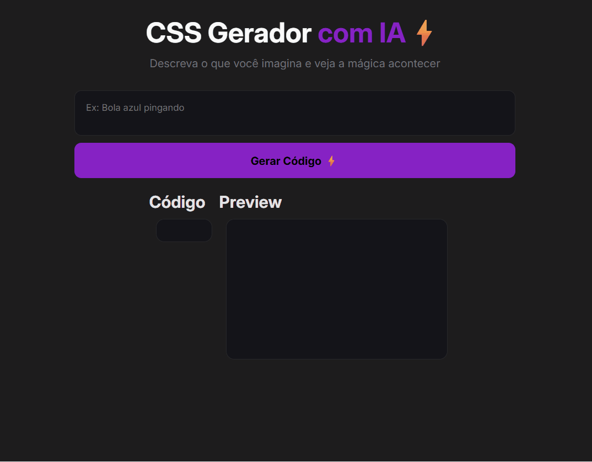

# 🎨 CSS AI Generator | Gerador de CSS com IA


Aplicação web que utiliza Inteligência Artificial para gerar código CSS a partir de descrições em linguagem natural.

O usuário descreve um elemento visual (exemplo: *"bola azul quicando"*) e a aplicação gera automaticamente o CSS necessário, além de exibir uma representação visual do resultado.

Este projeto foi desenvolvido durante um workshop do **DevClub**, com foco em integração com APIs de IA e manipulação dinâmica de interface.

---

## 🖥️ Preview



---

## 🌍 Deploy

🔗 **Aplicação online:**

<a href="https://aline-mmiranda.github.io/css-gerador/" target="_blank">Acessar projeto</a>

---

## 🎯 Objetivo do projeto

O objetivo foi praticar:

- Consumo de API externa
- Integração com IA generativa
- Manipulação dinâmica do DOM
- Tratamento de dados assíncronos
- Organização de aplicações front-end

Além disso, o projeto explora uma ideia moderna muito utilizada hoje:

**Transformar linguagem natural em código.**

---

## ⚙️ Funcionalidades

A aplicação permite:

- Descrever um elemento visual em texto
- Enviar a descrição para a IA
- Receber o código CSS gerado
- Exibir o código na interface
- Renderizar visualmente o resultado
- Atualizar o preview dinamicamente

Fluxo da aplicação:

Usuário descreve elemento →  
API recebe prompt →  
IA gera CSS →  
Código exibido →  
Elemento renderizado.

---

## 🤖 Integração com IA

O projeto utiliza a API da Grok para:

- Interpretar descrições textuais
- Gerar código CSS funcional
- Simular comportamento visual solicitado

Isso permitiu trabalhar conceitos como:

- Prompt engineering básico
- Requisições assíncronas
- Processamento de respostas JSON
- Renderização baseada em resposta da API

---

## 🧠 Desafio técnico 

O principal desafio foi:

**Realizar o consumo correto da API da IA e processar a resposta de forma utilizável no front-end.**

Dificuldades envolvidas:

- Estrutura da requisição
- Tratamento da resposta
- Extração do CSS retornado
- Aplicação dinâmica do código
- Tratamento de erros básicos

---

## 📐 Arquitetura da solução

**HTML**
Estrutura da interface e campos de entrada.

**CSS**
Layout da aplicação e preview visual.

**JavaScript**
Responsável por:

- Capturar input do usuário
- Enviar requisição para API
- Processar resposta
- Atualizar interface
- Renderizar preview

---

## 🏗️ Estrutura do projeto

```text
📦 css-gerador
 ┣ 📂 src
 ┃ ┗ ⚡ scripts.js → lógica da aplicação
 ┣ 📂 assets
 ┃ ┣ 🎨 styles.css → estilos
 ┃ ┗ 🖼️ images → screenshot
 ┣ 🌐 index.html → interface
 ┣ ⚙️ config.js → configurações
 ┗ 📄 README.md → documentação
```

---

## 🛠️ Tecnologias utilizadas

- HTML5
- CSS3
- JavaScript (ES6+)
- API Grok (IA generativa)

---

## 📊 Competências demonstradas

Este projeto demonstra:

✔ Integração com IA  
✔ Consumo de API  
✔ Programação assíncrona  
✔ Manipulação dinâmica do DOM  
✔ Organização de código  
✔ Deploy de aplicações  
✔ Pensamento orientado a solução  

---

## 📚 Aprendizados

Este projeto ajudou a desenvolver:

- Integração de front-end com serviços externos
- Leitura e interpretação de documentação de API
- Resolução de problemas reais
- Mentalidade de construção de produto
- Adaptação a tecnologias emergentes (IA)

---

## 👩‍💻 Autora

**Aline M Miranda**  
Desenvolvedora Front End em formação

[](https://github.com/aline-mmiranda)
[](https://www.linkedin.com/in/aline-mmiranda)

---

## ⭐ Observação estratégica

Este projeto demonstra minha capacidade de integrar aplicações front end com tecnologias modernas como Inteligência Artificial, reforçando minha evolução técnica e adaptação às tendências atuais do desenvolvimento web.